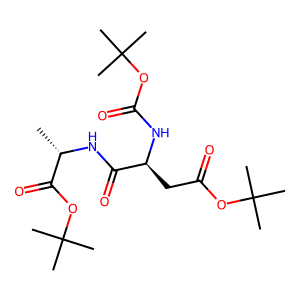
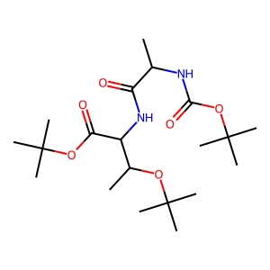

# Case Study: 04dbc4ee-9744-46af-8192-b31eca9da1fb

## Comparison Summary

| Model | Status | Similarity | Prediction SMILES | Image |
|-------|--------|------------|-------------------|-------|
| **Gemini-3-Flash** | ✅ Success | 1.00 | `CC(C)(C)OC(=O)N[C@@H](CC(=O)OC(C)(C)C)C(=O)N[C@@H](C)C(=O)OC(C)(C)C` |  |
| **Kimi-K2-Thinking** | ❌ Fail | 0.46 | `CC(NC(=O)OC(C)(C)C)C(=O)NC(C(=O)OC(C)(C)C)C(C)OC(C)(C)C` |  |

## Ground Truth
**SMILES**: `C[C@H](NC(=O)[C@H](CC(=O)OC(C)(C)C)NC(=O)OC(C)(C)C)C(=O)OC(C)(C)C`

